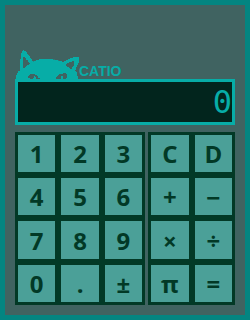

# Catculator

## Preview

## Description
Simple calculator that is designed to process basic mathematical operations: +,-,*,/
Calculator also supports floating-point operands, can negate the entered value, and provides an acces to a value Pi.

User can make input either by pressing virtual buttons, or via keyboard. 

Calculator supports full and partial clear. User can full-clear entered expression by pressing virtual Clear button: "C". Deletion of the last entered digit can be achieved by either pressing virtual Delete button: "D", or by pressing keyboard key "Backspace".

After entering a full expression, user can calculate it by pressing either: virtual Equals button: "=", or by pressing keyboard keys: "Enter" or "=".

User is also able to calculate entered expression by pressing any of the basic operators: +,-,*,/, with the notion that this action will also queue this operator as a next expression operator and currently produced answer as a left-hand-side operand of next expression. 

